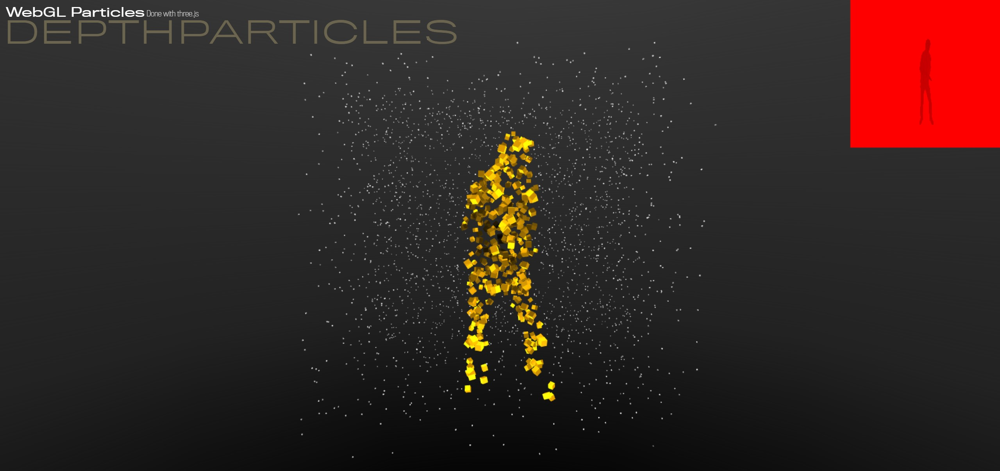

# Depth-grab

Three.js experiment with advanced technic to grab depth of glb to texture to display in particle field

## Description

This project aim to do fast and precise hull, for Three.js skinned mesh, using 2 orthographic cameras to grab depthmap in render targets.

Both front and back textures are passed to shader that check if particles are inside the calculated depths.

press SPACE to show textures (depth and diffuse)
press SHIFT + 1 for camera front depth
press SHIFT + 2 for camera front diffuse
press SHIFT + 3 for camera front diffuse
press SHIFT + 4 for camera front depth

## Youtube video

Check the [video](https://youtu.be/n5oOevmhbI8) on youtube.

